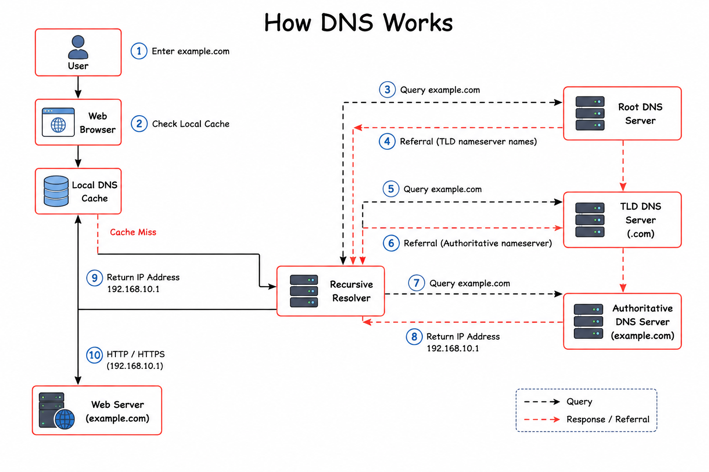
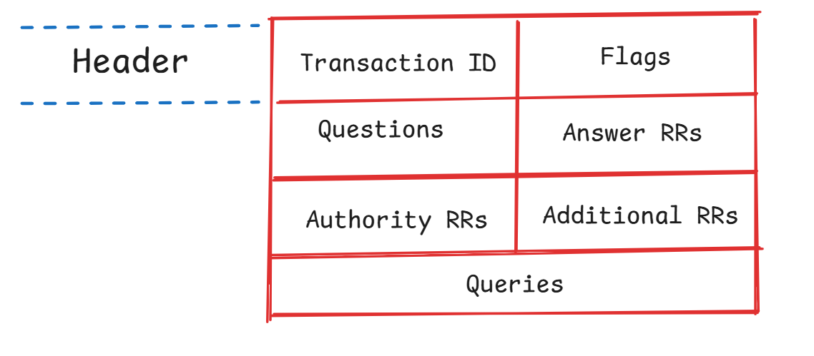
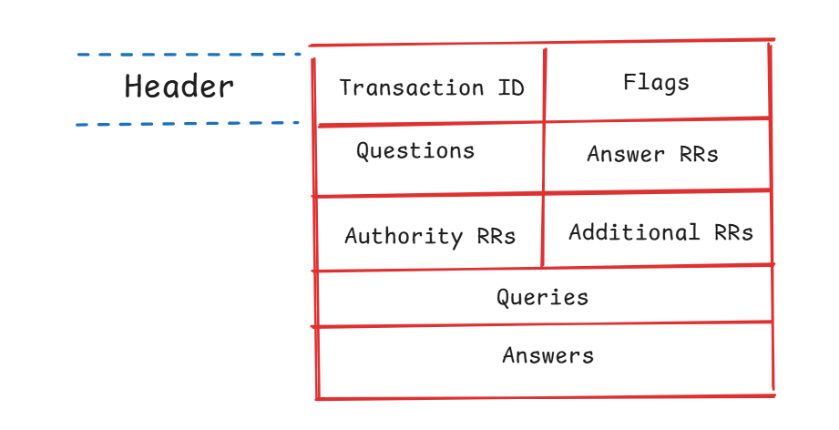

# Domain Name System (DNS)

## Overview

The **Domain Name System (DNS)** is a hierarchical naming system that translates human-readable domain names into IP addresses, allowing computers to locate and communicate with servers on a network.

DNS is often referred to as the **"phone book of the Internet"** because users can access websites using domain names instead of remembering numerical IP addresses.

---

## How DNS Works



When a user enters a domain name into a web browser, the Domain Name System (DNS) performs a series of steps to translate the domain name into an IP address.

---

### Step 1 – User Enters a Domain Name

The user enters a domain name into a web browser.

**Example:**

```text
www.example.com
```

---

### Step 2 – Local Cache Lookup

The browser and operating system first check the **Local DNS Cache** to determine whether the IP address has already been stored.

If the record exists, the cached IP address is returned immediately.

If the record is not found, the request continues to the DNS Resolver.

---

### Step 3 – DNS Resolver

The browser sends the DNS Query to a **Recursive DNS Resolver**, which is usually provided by an Internet Service Provider (ISP) or a public DNS service.

The resolver is responsible for finding the correct IP address on behalf of the client.

---

### Step 4 – Root DNS Server

The DNS Resolver sends a query to a **Root DNS Server**.

The Root DNS Server does not know the requested IP address, but it returns a referral to the appropriate **Top-Level Domain (TLD) Server**.

---

### Step 5 – Top-Level Domain (TLD) Server

The DNS Resolver sends another query to the **TLD DNS Server**.

The TLD DNS Server identifies the correct **Authoritative DNS Server** and returns its address to the resolver.

Examples of TLDs include:

- `.com`
- `.org`
- `.net`
- `.id`

---

### Step 6 – Authoritative DNS Server

The DNS Resolver sends a query to the **Authoritative DNS Server**.

The Authoritative DNS Server stores the official DNS records for the requested domain.

---

### Step 7 – Return IP Address

The Authoritative DNS Server returns the requested DNS record (such as an **A Record** or **AAAA Record**) containing the destination IP address to the DNS Resolver.

---

### Step 8 – DNS Resolver Responds

The DNS Resolver caches the result for future requests and sends the IP address back to the user's computer.

---

### Step 9 – Browser Receives the IP Address

The web browser receives the IP address and prepares to establish a connection with the destination server.

**Example:**

```text
www.example.com

↓

192.168.10.1
```

---

### Step 10 – Connect to the Web Server

The browser establishes an **HTTP** or **HTTPS** connection to the web server using the returned IP address and loads the requested website.

---

# DNS Query

## Overview

A **DNS Query** is a request sent by a client to a DNS server asking for information about a domain name.

The most common request is to obtain the IP address associated with a domain.

---

## Types of DNS Query

### 1. Recursive Query

The DNS server is responsible for finding the final answer on behalf of the client.

The client receives either the requested record or an error message.

### 2. Iterative Query

The DNS server returns the best available information, usually referring the client to another DNS server that is closer to the final answer.

### 3. Non-Recursive Query

The DNS server already has the requested information in its cache or is authoritative for the requested domain, allowing it to respond immediately.

---

## DNS Query Structure

A DNS Query message consists of several sections.



### Header

The Header contains information used to identify and manage the DNS request.

| Field          | Description                                                              |
| -------------- | ------------------------------------------------------------------------ |
| Transaction ID | Unique identifier used to match a query with its corresponding response. |
| Flags          | Contains control information such as query type and recursion settings.  |

### Questions

Contains the domain name and DNS record type requested by the client.

### Answer RRs

Usually empty because the client is requesting information.

### Authority RRs

Usually empty in a DNS Query.

### Additional RRs

May contain optional information such as EDNS data.

### Queries

Contains the requested domain name and record type (A, AAAA, MX, etc.).

---

# DNS Response

## Overview

A **DNS Response** is the reply sent from a DNS server back to the client after processing a DNS Query.

The response contains the requested DNS records or an error if the domain cannot be resolved.

---

## DNS Response Structure

A DNS Response message is returned by the DNS server after processing a DNS Query.



---

### Header

Contains information about the response.

| Field          | Description                                                                   |
| -------------- | ----------------------------------------------------------------------------- |
| Transaction ID | Must match the Transaction ID from the DNS Query.                             |
| Flags          | Indicates whether the query was successful and contains response information. |

---

### Questions

Copies the original DNS Query.

---

### Answer RRs

Contains the requested DNS records.

---

### Authority RRs

Provides information about the authoritative name server.

---

### Additional RRs

Contains additional DNS-related information when available.

### Queries

---

Contains the original domain name requested by the client.

---

### Answers

Contains the DNS record returned by the server, such as an A Record or AAAA Record.

---

# Common DNS Record Types

## A Record

Maps a domain name to an **IPv4** address.

**Example:**

```text
example.com
↓

192.168.1.10
```

---

## AAAA Record

Maps a domain name to an **IPv6** address.

---

## CNAME (Canonical Name)

Creates an alias that points one domain name to another domain name.

**Example:**

```text
www.example.com

↓

example.com
```

---

## MX (Mail Exchange)

Specifies the mail server responsible for receiving email for a domain.

---

## NS (Name Server)

Specifies the authoritative DNS servers responsible for a domain.

---

## TXT (Text Record)

Stores text-based information associated with a domain.

Commonly used for:

- SPF
- DKIM
- Domain verification

---

# Summary

- DNS translates **domain names into IP addresses**.
  <br>

- DNS resolution follows the path: **Client → Resolver → Root Server → TLD Server → Authoritative Server**.
  <br>
- A **DNS Query** is a request sent by a client.
  <br>
- A **DNS Response** is the reply returned by the DNS server.
  <br>
- Common DNS record types include **A**, **AAAA**, **CNAME**, **MX**, **NS**, and **TXT**. <br>
